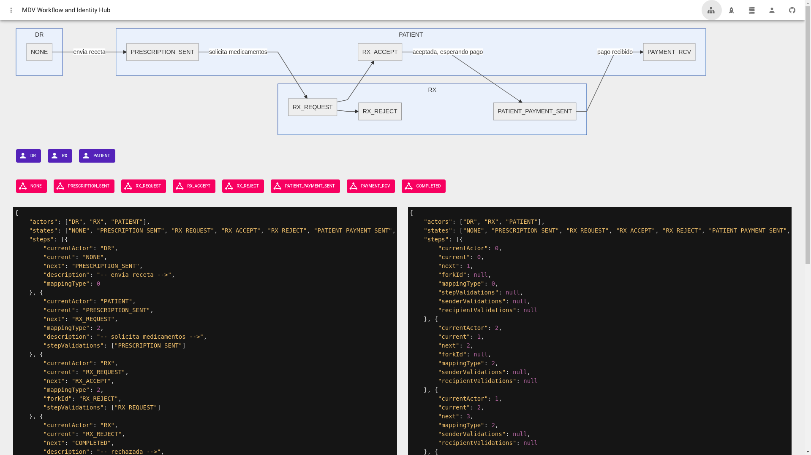
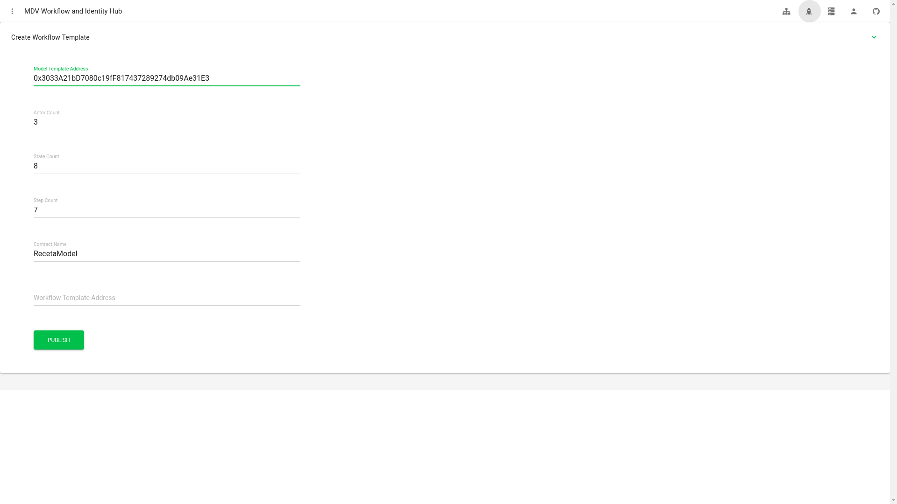

# MDV - Mensajeria de Documentos Verificables
## WF API v1.0.0
#### Autor:  Rogelio  Morrell C. , 2020
## Introduccion
**MDV** es una solucion descentralizada de solicitudes de documentos que permite crear workflows de tramites por medio de `Solidity` y `Javascript`. 

Adicionalmente incluye soporte para `PKCS#7` para documentos PDF e integracion de identidad digital por medio de `ethr-did`.

## Contratos

### WTemplate
`WTemplate` define la plantilla madre de la solucion, esta se encarga de:

* Creacion de la secuencia de pasos
* Validacion y ejecuccion de pasos
* Roles
* Administracion de subscripciones de usuarios

### IWModel y WFStorage
Un modelo requiere heredar  de `IWModel`, esta interfaz es usada por `WTemplate` para acceder e interactuar con el modelo.

`WFStorage` contiene validadores y otros utilitarios.

### ExtensionEventRegistry
El registro de extension es el contrato del API de Extensiones.

## Ambientes de pruebas

### Ropsten

* **Approvals**: `0x7740A63CF6FC3827589861f7D3a1Ca6307a59480`
* **ExtensionEventRegistry**: `0x5b20dF810d32184eF79cb2eFc7bE9dAeA7c4fb19`
* **WFactory**: `0x04d7BAEBc5932D2dc0e50FA18B62d2162616C848`
* **WTemplate**: Creado por `WFactory`

## Mainnet

**Pronto**

## Plantillas de Flujos
Un `WTemplate` consta de los siguientes componentes:

* `Actores`: Los diferentes tipos de personas en un flujo.
* `Pasos`: Las transiciones entre los estados del flujo, contiene ademas ramificaciones, extensiones y validaciones.
* `Modelo`: El modelo implementa la logica de negocios del flujo, aplicando un API CRU (Create Read Update).


## Paso 1 - Modelo de datos

 > Ver ejemplos de [recetas](https://github.com/molekilla/mdv-contracts/tree/master/contracts/examples)  el cual utiliza RLP encoding


El modelo implementa `onAdd` y `updateSwitch` que son llamados por `WTemplate`. Cada modelo es recomendable tenga uno o mas `structs` que definen el modelo de datos enviados en el `payload`. 

```solidity
pragma solidity ^0.6.0;
pragma experimental ABIEncoderV2;


import "./WStep.sol";
import "./WFStorage.sol";
import './ExtensionEventRegistry.sol';
import './IExtension.sol';
import "../../node_modules/@openzeppelin/contracts/utils/ReentrancyGuard.sol";

contract TestDocumentModel is WFStorage, ExtensionEventRegistry, ReentrancyGuard {

    address owner;
    struct TestDocument {
        string fileIpfsJson;
        string certifiedFilesIpfsJson;
        string email;
        string description;
        string name;
        string lastname;
        uint256 amount;
        // system
        address user;
        address recipient;
        bytes32 status;
    }

    mapping (uint256 => TestDocument) public table;
    ExtensionEventRegistry private extReg;
    constructor(address r) public {
        owner = msg.sender;
        extReg = ExtensionEventRegistry(r);
    }
    
    function getStructAsTuple(bytes calldata data) external returns(string memory, string memory, string memory, string memory, 
        string memory, string memory, uint256) {
        return abi.decode(data, (string, string, string, string, string, string, uint256));
    }   

    function getStruct(bytes calldata data) external returns(TestDocument memory) {
    (string memory a, string memory b, string memory c, string memory d, 
        string memory e, string memory f, uint256 g) =  abi.decode(data, (string, string, string, string, string, string, uint256));
        return TestDocument(a, b, c, d, e, f, g, address(0), address(0), bytes32(0));
    }   
    function onAddRow(
        address to,
        address sender, 
        uint256 next,
        uint256 current,
        bytes memory fields
        ) public nonReentrant returns (bool) {

        currentDocumentIndex = rowCount;
        rowCount = rowCount + 1;
        
        table[rowCount-1] = this.getStruct(fields);
        table[rowCount-1].user = sender;
        table[rowCount-1].recipient = to;
        table[rowCount-1].status = keccak256(abi.encodePacked(stepsByInitState[next].current));

        return true;
    }

    function onUpdate(uint256 doc, 
        address to,
        address sender, 
        uint256 next,
        uint256 current,
        TestDocument memory document
        ) public returns (bool) {

        validateSender(current,  sender);
        validateRecipient(current, to);
        validateStatus(current, stepsByInitState[current].current);

        currentDocumentIndex = doc;


        table[doc].status = keccak256(abi.encodePacked(stepsByInitState[next].current));
        if (keccak256(abi.encodePacked(table[doc].certifiedFilesIpfsJson)) != keccak256(abi.encodePacked(""))) {
            table[doc].certifiedFilesIpfsJson = document.certifiedFilesIpfsJson;
        }

        return true;
    }

    function onExtensionUpdate(uint256 doc, 
        address to,
        address sender, 
        uint256 next,
        uint256 current, uint256 extensionEvtId,
        TestDocument memory document
        ) public nonReentrant returns (bool, uint256) {
        validateStatus(next, stepsByInitState[current].current);

        uint256 calculatedNextFork = stepsByInitState[current].forkId;
        IExtension ext = IExtension(extReg.read(extensionEvtId).extContract);
        if (ext.canExec(extReg.read(extensionEvtId).id, sender) && keccak256(bytes(extReg.read(extensionEvtId).name)) == keccak256(bytes("approvals"))) {        
            if (ext.executeExtension(extReg.read(extensionEvtId).id, sender, abi.encodePacked(document.amount))) {
                table[doc].status = keccak256(abi.encodePacked(stepsByInitState[current].next));
            } else {
                calculatedNextFork =  stepsByInitState[current].forkId;
                table[doc].status = keccak256(abi.encodePacked( stepsByInitState[current].forkId));
            }
            
        }

        currentDocumentIndex = doc;

        if (keccak256(abi.encodePacked(table[doc].certifiedFilesIpfsJson)) != keccak256(abi.encodePacked(""))) {
            table[doc].certifiedFilesIpfsJson = document.certifiedFilesIpfsJson;
        }

        return (true, calculatedNextFork);
    }

    function updateSwitch(uint256 doc, 
        address to,
        address sender, 
        uint256 next,
        uint256 current,
        uint256 extensionEvtId,
        bytes memory fields
        ) public returns (bool, uint256) {
         
        uint256 calculatedNextFork = next;
            if (extensionEvtId > 0) {
                (bool ok, uint256 fork) = this.onExtensionUpdate(doc, to, sender, next, current, extensionEvtId, this.getStruct(fields));
                calculatedNextFork = fork;
            } else {
                this.onUpdate(doc, to, sender, next, current, this.getStruct(fields));
            }
        return (true, calculatedNextFork);
    }
}
```

Este payload se codifica en bytes y es creado de este modo:

```javascript
    const payload = wf.createPayload({
        fileIpfsJson: JSON.stringify([{ path: '', content: '' }]),
        certifiedFilesIpfsJson: '',
        email: '',
        description: 'Testing workflow',
        name: 'John',
        lastname: 'Lopez',
        amount: 100,
    });

```


## Paso 2 - Editor de Workflow



El Editor de Workflow es el disenador oficial para crear flujos para el contrato inteligente.

El JSON en formato Mermaid genera un JSON compatible con el API Javascript `WorkflowBuilder`.

Una vez este completado el flujo, haga clic en el boton de cohere para despliegue.

### Propiedades de un paso

- **currentActor**: Actor cual ejecuta el paso actual
- **current**: Paso actual
- **next**: Siguiente paso
- **mappingType**: 0 = Crear, 2 = Actualizar
- **forkId**: Ramificacion, inicia en 1
- **stepValidations**: Validaciones de  estados, usando un operador OR
- **senderValidations**: Validaciones de persona que envia la solicitud
- **recipientValidations**: Validaciones de recipientes


## Paso 3 - Despliegue



El despliegue inserte la direccion de su modelo de datos, adicionalmente verifique que los pasos, actores y estados concuerden con lo que va a publicar, si los pasos no estan correctamente dentro del rango (menos de 40), puede que no se haga el despliegue e incurra en costos de gas innecesarios.

El despliegue primero crea el `WTemplate` y retorna la direccion por medio de un evento `LogWorkflowCreated` y en el segundo llamado ejecuta la creacion del flujo con `WTemplate.createWF`.


## Paso 4 - Permisos y Cuentas

PENDIENTE / TODO


## Extension API
El `Extension API` es la forma de extender la funcionalidad basica de MDV. Con este API es posible crear otros tipos de interacciones entre los documentos, tramites y personas. Un ejemplo de una extension es un modulo de votaciones, usado en tramites de prestamos hipotecarios o de automoviles.

La solucion incluye un contrato inteligente para aprobaciones. 

### Como funciona una extension con el flujo

1) Crear uno o mas estados relacionados a la extension. En este ejemplo tenemos un estado `MULTI_SIGNERS`.
2) Crear los pasos posibles (outcomes) incluyendo su forkId (forkId siempre inicia desde 1 para diferenciar de fork = 0 que es ningun fork).

```
ACCEPTED -> MULTI_SIGNERS
ACCEPTED -> CERTIFIED (fork step)

MULTI_SIGNERS -> CERTIFIED
MULTI_SIGNERS -> MULTI_SIGNERS (fork step)
```
```javascript
  wf.createStep({
    currentActor: wf.getActor('NOTARY'),
    current: wf.getState('ACCEPTED'), 
    next: wf.getState('MULTI_SIGNERS'),
    mappingType: 2,
    forkId: wf.getState('CERTIFIED'),
    stepValidations: [wf.getState('ACCEPTED')],
    recipientValidations: ['0x1198258023eD0D6fae5DBCF3Af2aeDaaA363571r'],
  });
  wf.createStep({
    currentActor: wf.getActor('NOTARY'),
    current: wf.getState('MULTI_SIGNERS'), 
    next: wf.getState('CERTIFIED'),
    mappingType: 2,
    forkId: wf.getState('MULTI_SIGNERS'),
    stepValidations: [wf.getState('ACCEPTED'), wf.getState('MULTI_SIGNERS')],
    recipientValidations: ['0x1198258023eD0D6fae5DBCF3Af2aeDaaA363571r','0xaaC58E89996496640c8b5898A7e0218E9b6E90cR'],
  });
```

3) Registrar evento de la extension

En este caso necesitamos crear las personas firmantes autorizadas previamente. El id generado lo usamos en la ejecuccion del flujo.

```javascript

  // 3) Add any extension addons - Create approval check
  const logs = await approvals.add(
    owner, // dueno del registro
    ['0x...', '0x...'], // direcciones
    [515, 300], // montos, por ahora el modulo de aprobaciones solo soporta uint
    2,         // max numero de firmantes
    {
      from: owner,
    }           // propiedades de web3
  );

```

4) Ejecutar el paso usando extension id


```javascript
        const payload = wf.createPayload({
          fileIpfsJson: '',
          certifiedFilesIpfsJson: '',
          email: '',
          description: '',
          name: '',
          lastname: '',
          amount: 200,
        });

        let tx = await wf.executeStep(template, {
          to: userAddr,
          step: wf.getState('ACCEPTED'),
          actor: wf.getActor('NOTARY'),
          documentId: 0,
          from: userAddr2,
          extensionId: approvalExtensionId,  // extension id a ejecutar
          payload,
        });

```

## Forking

Un flujo no siempre es secuencial, puede tener ramificaciones y bifurcaciones. Para facilitar el API, el `forkId` debe en la mayoria de las implementaciones ir acompanado de una extension. Un caso comun que no requiere tener una extension seria los rechazos.

Un ejemplo de manejo de rechazos seria si existe `forkId`, evaluar la logica de negocios (`ACEPTAR/RECHAZAR`), en caso de rechazo, ir al siguiente con el valor del `forkId`.

## Librerias

`WFTemplate` incluye una libreria para administracio de roles e identidades, todos los usuarios de la solucion deben estar previamente enrolados antes de utilizar la plataforma.

## Identidad Digital
Soporte para el metodo DID `ethr-did`, lo cual permite acceder a los features del `ethr-did-resolver` (delegacion, reasignacion, etc)

## PKCS#7
Soporte para `X509 PKCS#7` en modo detached. El firmado se realiza desde un cliente web, y sube al storage descentralizado el documento y firma criptografica.

Un API backend valida la firma del documento con la llave publica del firmante.

## Encriptacion Descentralizada
Soporte para `Swarm Ethereum` que ofrece encriptacion en reposo integrado, lo cual permite mas eficiencia al no tener que procesar por servicios intermediarios.

## Solicitudes Verificables
Soporte para `W3C Verificable Claims` por medio de cliente usando librerias modificadas de proyectos open source, esto permite integrar `Verificable Claims` con Metamask permitiendo un mejor user onboarding. Utilizamos JWT como medio de empaquetado de firmas y el algoritmo de encriptacion `ECDSA sep256k1`. Futuras versiones adicionalmente con soporte para EdDSA y cartera criptografica por web.
